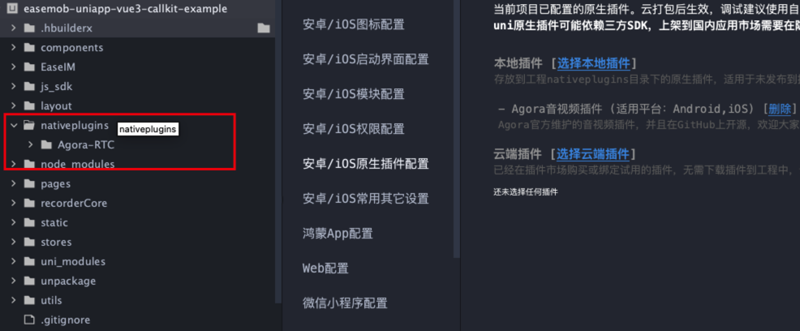
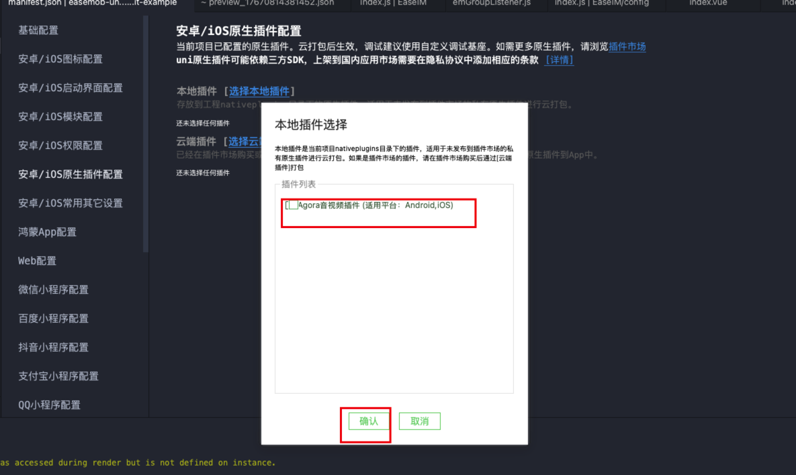
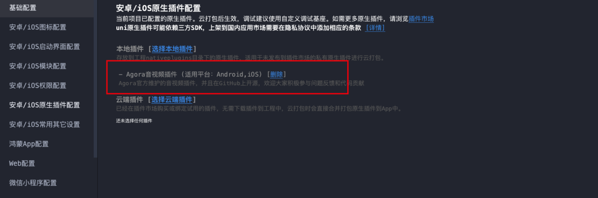

# webim-uniapp-demo-vue3

# 介绍

demo 包含以下核心功能

- 会话列表
- 系统通知
- 联系人
- 添加好友
- 群组创建
- 群组详情
- 我的
- 用户属性
- 单人聊天
- 群组聊天
- 文本、图片、语音、附件、个人名片收发。
- 原生端声网音视频拨打功能。

# 在本地跑起来

拉取代码，并执行`npm install`,在 HBuliderX 工具点击运行至想要的平台中即可运行起来。

# 项目结构核心目录说明

```shell
|- components 自定义组件目录
    |-Agora-RTC-JS AgoraRtc js API组件
    |-emChat 聊天页面核心组件（消息列表、输入框相关代码）
    |-emCallKit AgoraRtc 核心业务逻辑组件
    |-swipedelete 测滑删除组件
|-static/images demo中用到的图片 还有表情
|-EaseIM 环信IM核心逻辑文件
    |-config IM相关配置
    |-constant 相关常量
    |-imApis 项目中所用IM SDK api方法
    |-listener IM监听回调
    |-utils 相关工具
    |-index.js 核心sdk初始化在此js文件中完成并导出
|-layout 布局（tab-bar）
|-recorderCore H5录音包
|-pages 功能页面
    |-login 登录页
    |-home home页面
    |-conversation 会话列表页面
    |-contacts 联系人页
    |-me 我的页面
    |-addNewFriend 加好友页
    |-addGroups 创建新群
    |-groups 群组列表页
    |-groupSetting 群组设置页
    |-notificaton 通知入口页（群组、单人通知）
    |-notificatonFriendDetail 加好友通知页
    |-notificatonGroupDetail 加群组通知页
    |-moreMenu 更多功能页面
    |-profile 用户属性展示页
    |-searchMsg 消息搜索页面
    |-settingGeneral 设置功能
    |-emChatContainer emChat聊天容器组件
    |-emCallKitPages AgoraRtc 相关页面组件
|-utils 工具类和sdk的一些配置
|-stores pinia store 全局状态管理
|-uni_modules uni插件包
|-node_modules 这个相信不需要特别说明（IMSDK在此中）
|-app.vue 项目根组件（注册IM监听事件、处理连接跳转）
|-app.json 注册页面以及全局的一些配置
|-app.css 一些全局样式
```

# 音视频功能的实现

## 简介

> 很多时候我们可能需要在即时通讯的业务逻辑基础上增加音视频相关功能,因此为了方便集成我们在本 Demo 中增加了有关音视频相关的逻辑代码,可以作为参考,也可以进行部分复用。

## ⚠️ 重要变更说明

**本项目已升级为本地插件引入方式,不再支持云端插件引入。**

- **插件版本**: Agora RTC v3.7.2
- **引入方式**: 本地 nativeplugins
- **插件来源**: [Agora-Uniapp-SDK v3.7.2](https://github.com/AgoraIO-Community/Agora-Uniapp-SDK/releases/tag/v3.7.2)
- **支持平台**: iOS / Android

### 为什么改为本地引入?

1. ❌ **云端插件已停止支持** - DCloud 插件市场的 Agora 云端插件已下架。

## 如何复用

### 1. 注册 Agora AppID

进入声网注册一个 appId,此 appId 与环信 appKey 概念类似,如何注册请参考[官方文档](https://docportal.shengwang.cn/cn/Agora%20Platform/get_appid_token?platform=All%20Platforms)

### 2. 引入本地插件

**📦 下载插件文件**

从 [Agora-Uniapp-SDK v3.7.2](https://github.com/AgoraIO-Community/Agora-Uniapp-SDK/releases/tag/v3.7.2) 下载完整的插件包。

**📁 放置插件文件**

将解压后的 `Agora-RTC` 文件夹完整复制到项目根目录的 `nativeplugins/` 目录下:

```
项目根目录/
└── nativeplugins/
    └── Agora-RTC/
        ├── ios/                    # iOS 平台插件
        │   ├── AgoraCore.xcframework/
        │   ├── AgoraRtcKit.xcframework/
        │   ├── AgoraRtcUniPlugin.framework/
        │   └── ...
        ├── android/                # Android 平台插件
        └── package.json
```

确保项目目录结构中包含 `nativeplugins` 文件夹:



**⚙️ 配置 manifest.json**

在 HBuilderX 中打开 `manifest.json` 文件,点击 **安卓/iOS 原生插件配置**:



点击 **选择本地插件**,勾选 **Agora音视频插件**,然后点击 **确认**:




**🔨 制作自定义基座**

⚠️ **重要**: 使用本地插件必须制作自定义基座或打包后才能使用,标准基座不包含此插件。

在 HBuilderX 中点击: `运行 -> 运行到手机或模拟器 -> 制作自定义调试基座`

### 4. 验证插件配置

制作好自定义基座后,运行以下代码验证插件是否正确加载:

```javascript
const AgoraRtcEngine = uni.requireNativePlugin('Agora-RTC-AgoraRtcEngineModule');
console.log('Agora Plugin:', AgoraRtcEngine ? '加载成功' : '加载失败');
```

### 5. 参考资料

~~[Agora-Native 插件](https://ext.dcloud.net.cn/plugin?id=3720)~~ (已废弃,请使用本地插件)

~~[Agora-JS 插件](https://ext.dcloud.net.cn/plugin?id=3741)~~ (已废弃,请使用本地插件)


### 6. 集成环信 SDK 与 CallKit

**📦 Agora-RTC-JS 组件说明**

本项目已包含 `Agora-RTC-JS` 组件(位于 `components/Agora-RTC-JS/`),该组件为 Agora 的 JavaScript API 封装,无需额外配置,可直接使用。组件包含:

- **RtcEngine.native.js** - RTC 引擎核心功能
- **RtcChannel.native.js** - 多频道管理
- **RtcSurfaceView.nvue** / **RtcTextureView.nvue** - 视频渲染组件
- **Classes.js** / **Enums.js** - 类型定义和枚举

✅ 此组件已集成在项目中,无需修改,可直接参考 `components/Agora-RTC-JS/` 目录下的实现和使用方式。

**🔧 集成步骤**

- 集成环信 uni-app 相关 SDK,按文档进行相关初始化配置并登录。
- 复制本 Demo 中的`emCallKit`、pages 下`emCallKitPages`至自己的项目文件目录中(不要忘记参考本 Demo 配置 `pages.json` 中相关页面路由地址)。
- 将注册好的 appid 在`emCallKit`下的`config`中进行配置。
- 在需要使用 Agora 音视频功能时需要将 IM 的实例传入到 callKit 组件内,参考代码如下。

```js
import { useInitCallKit } from "@/components/emCallKit";
const { setCallKitClient } = useInitCallKit();
//EMClient 为实例化后的IM，EaseSDK.message构建消息的方法
setCallKitClient(EMClient, EaseSDK.message);
```

> emCallKit 中还会将一些事件发布，主要作用为方便将频道内的一些动作通知到外层，比如收到邀请时，我们可能需要跳转至邀请页面。

```js
//订阅频道内事件，收到邀请可选择跳转至邀请页面。
import useCallKitEvent from "@/components/emCallKit/callKitManage/useCallKitEvent";
const { EVENT_NAME, CALLKIT_EVENT_CODE, SUB_CHANNEL_EVENT } = useCallKitEvent();
SUB_CHANNEL_EVENT(EVENT_NAME, (params) => {
  const { type, ext, callType, eventHxId } = params;
  console.log(">>>>>>订阅到callkit事件发布", params);
  //弹出待接听事件
  switch (type.code) {
    case CALLKIT_EVENT_CODE.ALERT_SCREEN:
      {
        console.log(">>>>>>监听到对应code", type.code);
        uni.navigateTo({
          url: "../emCallKitPages/alertScreen",
        });
      }
      break;
    case CALLKIT_EVENT_CODE.TIMEOUT:
      {
        console.log(">>>>>通话超时未接听");
      }
      break;
    default:
      break;
  }
});
```

- 向他人发起音视频通话邀请

```js
import useAgoraChannelStore from "@/components/emCallKit/stores/channelManger";
import { CALL_TYPES } from "@/components/emCallKit/contants";
const agoraChannelStore = useAgoraChannelStore();
//target 要呼叫的用户id 多人可传Array类型进去。
//callType 要呼叫的类型 CALL_TYPES.SINGLE_VIDEO视频、CALL_TYPES.SINGLE_VOICE语音
await agoraChannelStore.sendInviteMessage(target, callType);
```

# 常见问题

- 如何从短信验证码方式登录切换为用户 id+密码登陆？
  > 答：在 login>loginState>usePwdLogin 此配置项改为 false 即可。
